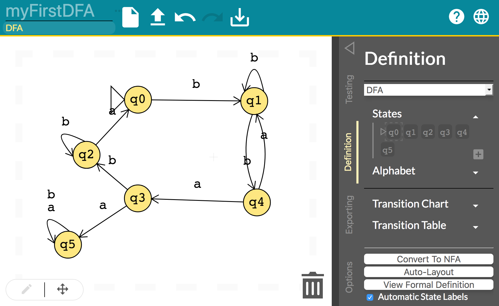
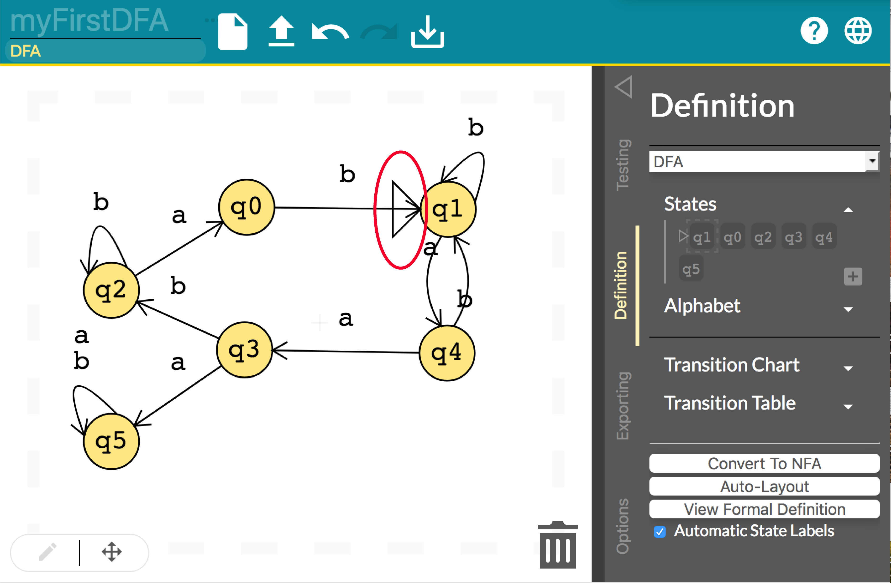

# Need Help ?

## Introduction

This is a basic tutorial to familiarize you with the working environment for flap.js. For first time users,
you will first experience our landing page which allows you go straight to the workspace or be redirected to this
tutorial. After the first use, you will always be redirected straight to the workspace.

## Noteworthy Features

When you launch the workspace you will be redirected to workspace. The workspace consists of one toolbar and a drawer
that provide multiple functionality. Flap.js currently supports DFA and NFA functionality, but this project will have
multiple iterations to add more functionality for it.

Noteworthy Workspace Functionality
* **Auto-Save Functionality** - The auto-save functionality prevent students from accidentally losing their work if
they refresh their browser or close the window.

* **Delete Mode** - To enable delete mode tap on the trash icon and then tap on the elements that you want to delete.  
You can also drag and drop items into the trashcan icon of the workspace, which will trigger the red outlined dashed
margins,warning you that you're about to delete something.

* **Cross Platform** - ~~You can only use JFLAP on your deskptop/laptop.~~ The workspace provides the same
functionality in both your desktop/laptop or your mobile device. We made sure that flap.js is responsive in web
browsers and mobile devices.

* **Debug Mode** - Is a step by step mode, for testing strings in order to analyze your machine.

## Workspace Essentials

### Creating a DFA or NFA
Starting from scratch on the workspace, you can choose to make a DFA or NFA by tapping the button displaying `DFA`
under the title of the workspace. The button will expand the drawer and trigger the `Definition Panel`. Inside
the `Definition Panel`, you can tap on the scroll button and choose either `DFA` or `NFA`.


### Creating Nodes
You can create a node in the workspace by `double tapping` anywhere within the workspace. By default, the first node
you make will be the start state. After creating the start node you can continue creating as many nodes as desired
by `double tapping`.


### Creating Transitions
You can create a transition between nodes by `tapping and holding` the desired starting node, and then
`dragging and releasing` once once the arrow is above the desired state.



### Deleting Nodes
As previously mentioned above you can enable `Delete Mode` by `tapping` on the `Trashcan Icon`, and then `tapping` on the
nodes you desire to delete. To disable `Delete Mode` tap on the Trashcan Icon again. The second way to delete one
node or multiple nodes, is using a `selection box` to grab multiple nodes and then `tap` on the selected box and `drag`
towards the `Trashcan Icon`.


### Changing the Start State
To change the start state `tap and drag` the triangle onto the desired start state.



### Creating Accept States
To create an accept state double tap to create the node and then single `tap` on the node to make it an accept state.


## Drawer Essentials

### Uploading a DFA/NFA File
To create a DFA or NFA from a file, just upload the file by dragging and dropping workspace or
clicking on the `more options icon (three dots)` next to the name of the workspace. **Note:** The file that is
being imported must be a `.txt` file type. The file must be formatted such that each string is on it's own line or
comma seperated.


*First Format*

file1.txt
```
010101010
101010110
100001100
```

*Second Format*

file2.txt

```
0101010101,010101010,0101010101
```


### Testing Single or Multiple Strings
Tap on the triangle on top right to expand the drawer, then select `Testing Panel`. Inside the testing panel test the
string by entering the string in the input with `test string` in it, and then tap on button `Run All Tests`.


### Importing Tests
To import test Tap on the triangle on top right to expand the drawer, then select `Testing Panel`  , then in the
testing panel tap on the button `Import Test`.

### Exporting
On the top of the workspace tap the `Export` button, that will open up the drawer with the `Exporting Panel`, and then
inside the `Exporting Panel` select the type of exporting or saving format you want.

### Converting from DFA to NFA (Vice Versa)
Tap on the triangle on top right to expand the drawer, then select `Definition Panel`, then inside the Definition
Panel tap on the `Convert To...` button.
